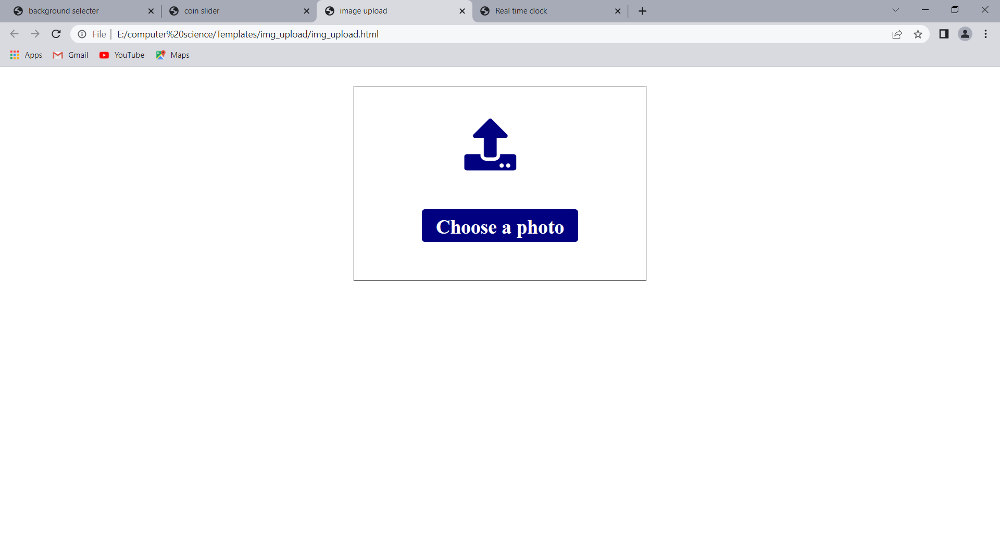
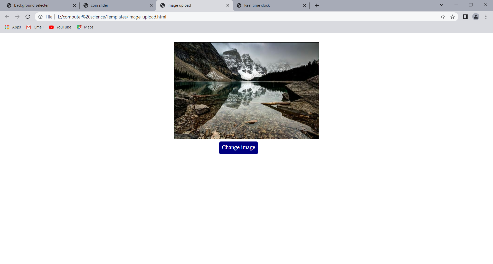
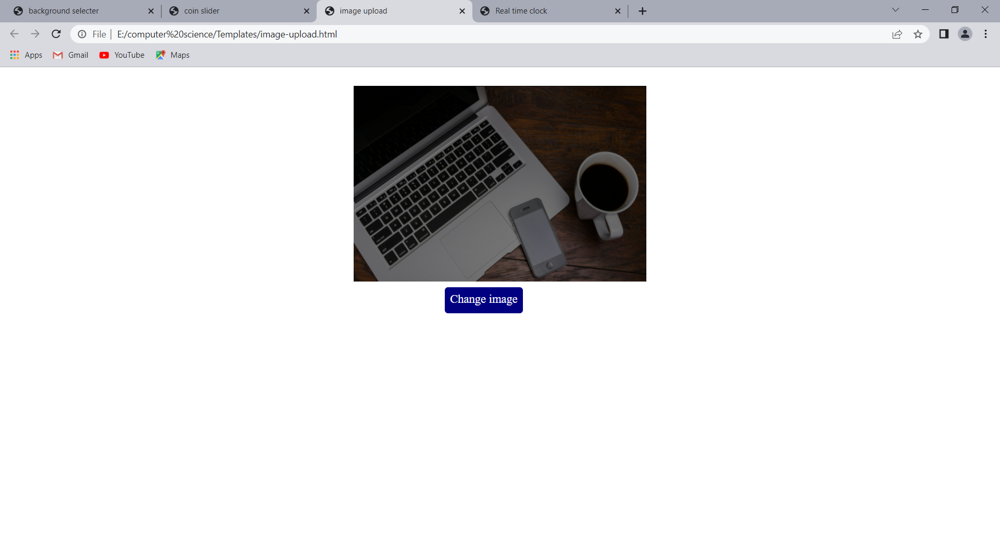

# Image-upload
 
**This is a custom image uploading using HTML and CSS**

**The screenshots of the above program is given below**

in the below picture you can select a image from internal storage to display

in the below picture you can change the picture to be displayed

